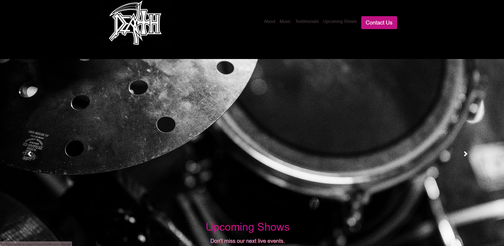
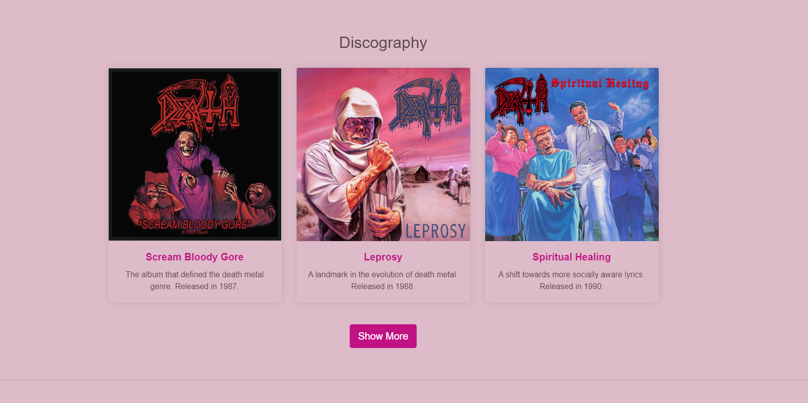
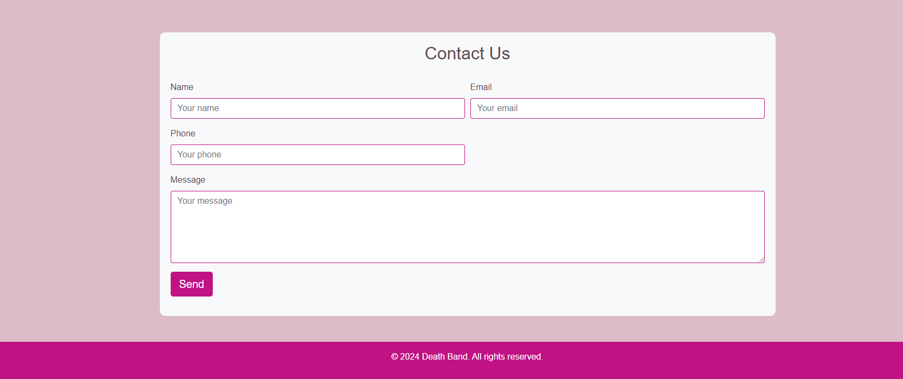

# Death Landing Page

This project is a landing page for the legendary death metal band Death, developed using HTML, CSS, and JavaScript. The goal is to create a modern and engaging page featuring interactive elements like sliders, API integration, and responsive design. The page includes core web components such as a header, navigation menu, main content sections, and footer.

The project utilizes external libraries like AOS for scroll animations, and it integrates the EmailJS API for sending messages through the contact form. Additionally, it uses the Last.fm API to display upcoming show dates and the band's biography, providing fans with up-to-date information directly on the page.

This is an exercise created for the FullStack Developer course by the +praTi and Codifica group.

## Screenshots

## Features

- Responsive Design: The layout adapts to different screen sizes, ensuring a great user experience on mobile and desktop devices.

- Interactive Elements: Incorporates sliders and animations to enhance user engagement.

- Contact Form: A user-friendly contact form that allows fans to send messages, integrated with the EmailJS API for seamless email sending.

- Live Show Data: Integration with the Last.fm API to display upcoming show dates and the band's biography, providing fans with up-to-date information.

## Technologies Used

- <a href="https://developer.mozilla.org/en-US/docs/Web/HTML" target="_blank">HTML: </a>For structuring the web page.
- <a href="https://getbootstrap.com/" target="_blank">Bootstrap: </a>For styling and layout.
- <a href="https://developer.mozilla.org/en-US/docs/Web/JavaScript" target="_blank">Javascript: </a> For interactivity and API integration.
- <a href="https://www.emailjs.com/docs/" target="_blank">EmailJs: </a> For handling form submissions and sending emails.
- <a href="https://www.last.fm/api" target="_blank"> LastFm: </a> For fetching live show data and artist information.
- <a href="https://michalsnik.github.io/aos/" target="_blank"> AOS (Animate On Scroll): </a> For adding animations when scrolling the page.

## How to Run the Project

To run this project locally, follow these steps:

1. Clone the repository:
   `git clone git clone https://github.com/Jesschuck/lp-tribute
`

2. Navigate to the project directory:
   `cd landing-page
`

3. Install the necessary dependencies: `npm install
`

4. Open the index.html file in your browser:
   `open index.html
`

Or you can right-click on index.html and select "Open with" and choose your preferred browser.
